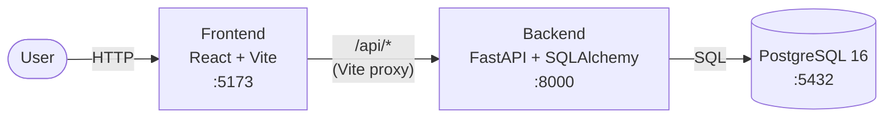
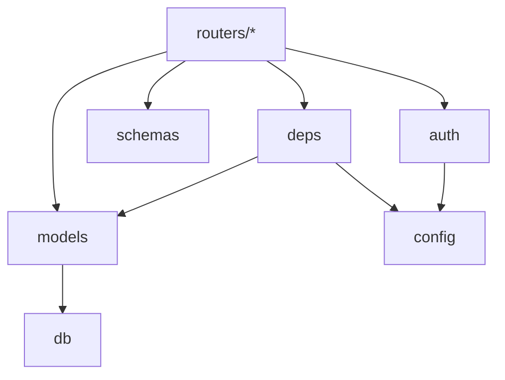
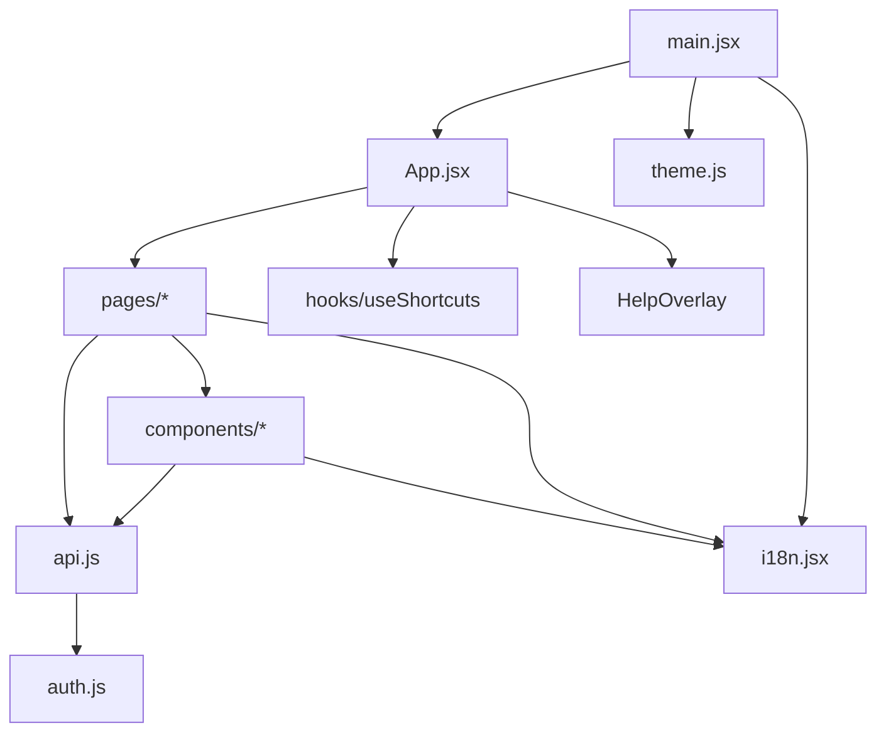
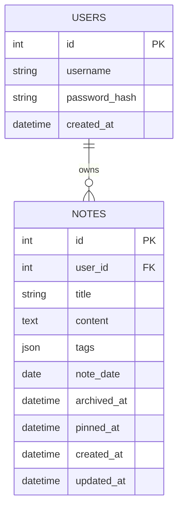

# Architecture

A small, single-user-per-account notes app. Three services, one repo.

## System overview



| Service    | Stack                                              | Port | Role                                        |
| ---------- | -------------------------------------------------- | ---- | ------------------------------------------- |
| `db`       | Postgres 16                                        | 5432 | Durable storage                             |
| `backend`  | Python 3.11, FastAPI, SQLAlchemy 2.0, Alembic, JWT | 8000 | REST API, auth, data access                 |
| `frontend` | React 18, Vite, React Router                       | 5173 | SPA; dev server proxies `/api` to `backend` |

All three are orchestrated by `docker-compose.yml`. The frontend talks to the backend through the Vite dev proxy — there is no direct browser → backend call in dev.

## Components & responsibilities

### Services

- **`db`** — owns all persistent state. No logic lives here beyond schema (managed by Alembic) and ownership indexes. External deps: none. Data volume: `db_data`.
- **`backend`** — the only component allowed to talk to `db`. Owns authentication (JWT issuing and verification), authorization (per-row `user_id` filtering), domain logic (notes, tags, calendar aggregation, archive/pin semantics, pagination), and request validation (Pydantic). Exposes HTTP only — no background jobs.
- **`frontend`** — a pure SPA. Holds no server state; the JWT in `localStorage` is its only persistent local state. Talks only to `/api/*` via the Vite dev proxy. Owns layout, user interaction, optimistic UX affordances (markdown preview, keyboard shortcuts, calendar rendering).

### Backend packages



- **`app/main.py`** — process entry point. Mounts CORS, routers, `/healthz`. No business logic.
- **`app/config.py`** — single source of truth for runtime configuration (`DATABASE_URL`, `JWT_SECRET`, etc.). Everything else imports `settings` from here.
- **`app/db.py`** — owns the SQLAlchemy engine, session factory, and `Base` (DeclarativeBase). Nothing else instantiates engines.
- **`app/models.py`** — ORM entities (`User`, `Note`). The only place that declares table shape.
- **`app/schemas.py`** — Pydantic DTOs for request bodies and responses. Decoupled from ORM so wire format can evolve independently (e.g., hiding fields from public responses).
- **`app/auth.py`** — password hashing (bcrypt) and JWT encoding. Pure functions; no I/O.
- **`app/deps.py`** — FastAPI dependencies: `get_db` (per-request session lifecycle) and `get_current_user` (JWT → `User`). Every protected route goes through `get_current_user`.
- **`app/routers/*`** — HTTP surface. Each router owns one area (`auth`, `account`, `notes`, `tags`) and is the **only** place allowed to call the ORM directly. Routers never import each other.
- **`alembic/versions/*`** — schema migrations, applied at container start. Must be reversible (both `upgrade` and `downgrade`).
- **`scripts/seed.py`** — idempotent demo data (wipes the demo user, recreates).
- **`scripts/dump_openapi.py`** — emits `app.openapi()` JSON; drives `make openapi-dump` and the drift test.

### Frontend packages



- **`main.jsx`** — app bootstrap: calls `initTheme()`, wraps the tree in `LangProvider` and `BrowserRouter`.
- **`App.jsx`** — route map, top-level header, global shortcut wiring, registers actions forwarded from `Notes.jsx` (new/search/save) so shortcuts can reach them.
- **`api.js`** — the single network seam. Centralizes `Authorization` header, 401-triggered token clear, and JSON envelope. No page talks to `fetch` directly.
- **`auth.js`** — JWT in `localStorage`. Tiny, deliberate boundary.
- **`theme.js`** — `light` / `dark` / `system` via a `data-theme` attribute on `<html>`. Listens to `prefers-color-scheme` when the preference is `system`.
- **`i18n.jsx`** — React Context provider, `t(key, vars)` hook, EN fallback when RU is missing. The only translation mechanism.
- **`hooks/useShortcuts.js`** — global `keydown` listener; ignores editable targets except for `Cmd/Ctrl+S`.
- **`components/*`** — presentational + small behavior: `NoteEditor` (draft state + markdown toolbar), `NoteList` (virtualized-ready row), `TagFilter`, `ThemeToggle`, `LanguageToggle`, `MarkdownToolbar`, `HelpOverlay`.
- **`pages/*`** — screens with data-fetching and orchestration: `Login`, `Register`, `Notes` (list + editor + bulk + pagination + pin/archive), `Calendar`, `Settings`.

### Dependency rules worth keeping

- `routers/*` may depend on `deps`, `schemas`, `models`, `auth`; they must **not** depend on each other.
- `models` depends only on `db`. Business logic does not live here.
- Frontend `components/*` stay presentational; fetching lives in `pages/*`.
- `api.js` is the only module that calls `fetch`.
- Any new environment variable flows through `app/config.py` on the backend and through `import.meta.env` (`VITE_...`) on the frontend — never read directly from `process.env` or `localStorage` in business code.

## Data model



- **Tags** are a JSON array on the note itself. The `/tags` endpoint derives the per-user list by scanning the user's notes. There is no separate `tags` table by design.
- **Ownership** is enforced in every query via `user_id = current_user.id`. There is no sharing model and no RBAC.
- **Soft-delete** uses `archived_at` (nullable timestamp). Default list view excludes archived.
- **Pinning** uses `pinned_at` (nullable timestamp). Non-null → sorted on top.

## Backend layout

```
backend/
├── app/
│   ├── main.py         FastAPI app, CORS, router mounts, /healthz
│   ├── config.py       pydantic-settings, env-driven (.env)
│   ├── db.py           engine + SessionLocal + DeclarativeBase
│   ├── models.py       ORM (SQLAlchemy 2.0 Mapped[] typing)
│   ├── schemas.py      Pydantic in/out schemas
│   ├── auth.py         bcrypt hashing, JWT encode
│   ├── deps.py         get_db, get_current_user (JWT → User)
│   └── routers/
│       ├── auth.py     /auth/register, /auth/login
│       ├── account.py  /account/change-password, DELETE /account
│       ├── notes.py    /notes CRUD, calendar, archive, pin, bulk-delete
│       └── tags.py     /tags
├── alembic/versions/   0001 init · 0002 archive+pin
├── scripts/
│   ├── seed.py         demo user + sample notes (make seed)
│   └── dump_openapi.py regenerates openapi.json (make openapi-dump)
├── tests/              pytest + cov (threshold 80%)
└── openapi.json        snapshot — drift test asserts equality with app.openapi()
```

## Frontend layout

```
frontend/src/
├── main.jsx            bootstraps LangProvider + Router + App
├── App.jsx             route map, header, global shortcuts wiring
├── api.js              fetch wrapper + API client
├── auth.js             JWT stored in localStorage
├── theme.js            light / dark / system via data-theme attribute
├── i18n.jsx            React Context, EN + RU, dotted keys with {name} interpolation
├── hooks/
│   └── useShortcuts.js global key bindings: n · / · Cmd+S · ? · Esc
├── components/         NoteEditor · NoteList · TagFilter ·
│                       ThemeToggle · LanguageToggle ·
│                       MarkdownToolbar · HelpOverlay
└── pages/              Login · Register · Notes · Calendar · Settings
```

Testing uses **vitest + jsdom + @testing-library/react**. Backend tests run independently with pytest against an in-memory SQLite per test.

## API surface

All paths are prefixed with `/api`. JWT is required everywhere except register/login and `/healthz`.

| Method              | Path                     | Notes                                                   |
| ------------------- | ------------------------ | ------------------------------------------------------- |
| POST                | `/auth/register`         | Public                                                  |
| POST                | `/auth/login`            | Public; returns JWT                                     |
| POST                | `/account/change-password` | Verifies current password                             |
| DELETE              | `/account`               | Cascade-deletes all notes of the user                   |
| GET                 | `/notes`                 | Paginated (`limit`/`offset`), `?archived`, `?q`, `?tag` — pinned first |
| POST                | `/notes`                 | Create                                                  |
| GET / PUT / DELETE  | `/notes/{id}`            | Get / update / hard-delete                              |
| POST                | `/notes/{id}/archive`    | Idempotent                                              |
| POST                | `/notes/{id}/unarchive`  | Idempotent                                              |
| POST                | `/notes/{id}/pin`        | Idempotent                                              |
| POST                | `/notes/{id}/unpin`      | Idempotent                                              |
| POST                | `/notes/bulk-delete`     | Body: `{"ids": [int]}`                                  |
| GET                 | `/notes/calendar`        | `year`, `month`; excludes archived                      |
| GET                 | `/tags`                  | Distinct tag list for the user                          |
| GET                 | `/healthz`               | Liveness                                                |

The full machine-readable schema lives at `backend/openapi.json`. Regenerate with `make openapi-dump`; a drift test in the backend suite fails if the committed snapshot is stale.

## Cross-cutting concerns

- **AuthN** — JWT HS256, `JWT_SECRET` from env; token sent as `Authorization: Bearer <token>`.
- **AuthZ** — ownership check in every route; no roles, no sharing.
- **Migrations** — Alembic; `alembic upgrade head` runs at backend container startup.
- **i18n** — two languages (`en`, `ru`); EN is the fallback when a key is missing.
- **Theming** — `data-theme="light|dark"` on `<html>`; `system` resolves from `prefers-color-scheme`.
- **Testing boundary** — backend uses SQLite in tests; any Postgres-specific SQL must stay behind SQLAlchemy or be called out.
